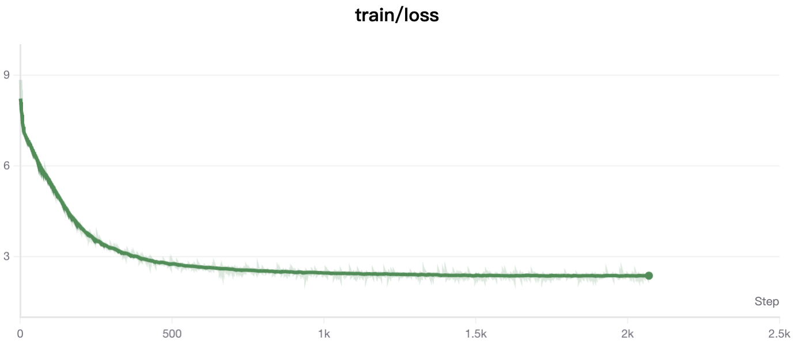
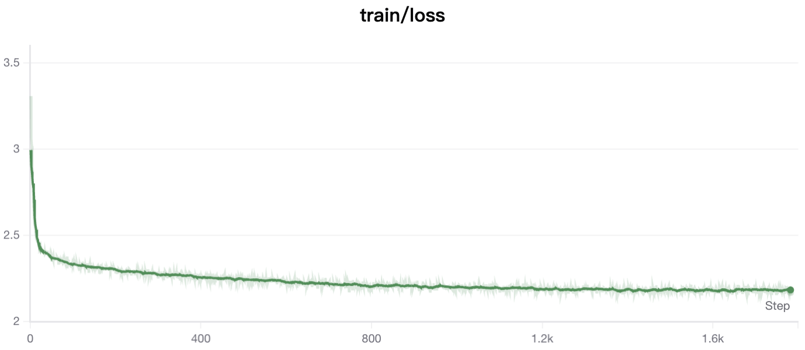

<div align="center">
<h3>TinyLLM-Forge</h3>
</div>


- 本仓库以`huggingface transformers`库为基础，以相对标准的形式展示了数据处理和训练的逻辑。
- 所有代码都是通用的，即只要是通过`transformers`适配的模型，本仓库代码均可跑通。
- 本仓库将会使用热门的第三方库，以帮助初学者入门工程代码。
- 本仓库将会逐步更新教学模块，包含算法的思想，工程的实现逻辑以及代码接口的简单介绍。
- 可在**Ascend NPU**上运行。

### 数据准备
为方便初学者，数据将从`modelscope`上下载。在命令行中**依次**执行：
```bash
pip install modelscope
# Replace <your_data_dir> with your local dir.
modelscope download --dataset 'gongjy/minimind_dataset' --local_dir <your_data_dir>
```
或者直接在仓库根目录下执行`bash scripts/download_dataset`。

### 训练模型
训练的原理和细节将会在单独的教程页面阐述，下面仅进行训练步骤的介绍。如果没跑通，一定要认真仔细完整地看完步骤和细节。

**0. 模型设置**
在设置路径之前，请先参考`/model`中的文件。文件包含`tokenizer.json, tokenizer_config.json, config.json, generation_config.json`, 如果你需要从预训练开始，那么下面提到的`model_name_or_path`需要是你的本地路径，且包含上述四个文件。你可以直接将`/model`设置为你的保存路径，也可以设置别的文件夹为保存路径，但是这样做需要你将这四个文件拷贝到你的目标文件夹中。

**1. 预训练（Pretrain）**
预训练的脚本路径为`./scripts/pretrain.sh`。若要进行预训练，请先检查脚本中的路径和设置，然后在命令行中执行`bash ./scripts/pretrain.sh`。

关键设置解释：
```bash
model_name_or_path=<path_to_your_model> # 替换此处变量，可以为huggingface中的模型仓库名称，比如Qwen/Qwen2.5-7B-Instruct， 也可以是你的本地模型路径。

train_data=<path_to_your_training_data> # 替换此处变量，可以选择用datasets库直接下载，也可以是本地数据路径。

output_dir=<saving_checkpoints_dir> # 选择训练后/训练中的检查点保存路径

deepspeed_config=<path_to_your_deepspeed_config> #一般为yaml文件
```

启动入口：
```bash
torchrun --nproc_per_node 8 trainer/pertrain.py
```
其中`8`为8卡启动，请根据实际设备情况自行设置。
若要快速进行预训练，请使用数据集中的`pretrain_hq.jsonl`，训练轮数设置为1轮。


**2. 监督微调（Supervised Fine-Tuning, SFT）**
预训练的脚本路径为`./scripts/sft.sh`。若要进行预训练，请先检查脚本中的路径和设置，然后在命令行中执行`bash ./scripts/sft.sh`。
关键设置解释同预训练。

**3. 其他算法代码**
即将完成。

### 训练过程记录
**预训练**

**SFT**

### TO DO
- [x] Pretrain, SFT代码测试
- [x] Online Distillation (在线蒸馏) 测试
- [ ] DPO, GRPO, PPO 测试
- [ ] MoE模型测试
- [ ] 教学文档


>感谢[minimind](https://github.com/jingyaogong/minimind)的开源，本仓库借用其模型和数据，构建一个第三方库的使用教程，帮助初学者快速对比简洁的训练代码和高度封装的热门库的训练代码。
---
### 参考/致谢
- [minimind](https://github.com/jingyaogong/minimind)


